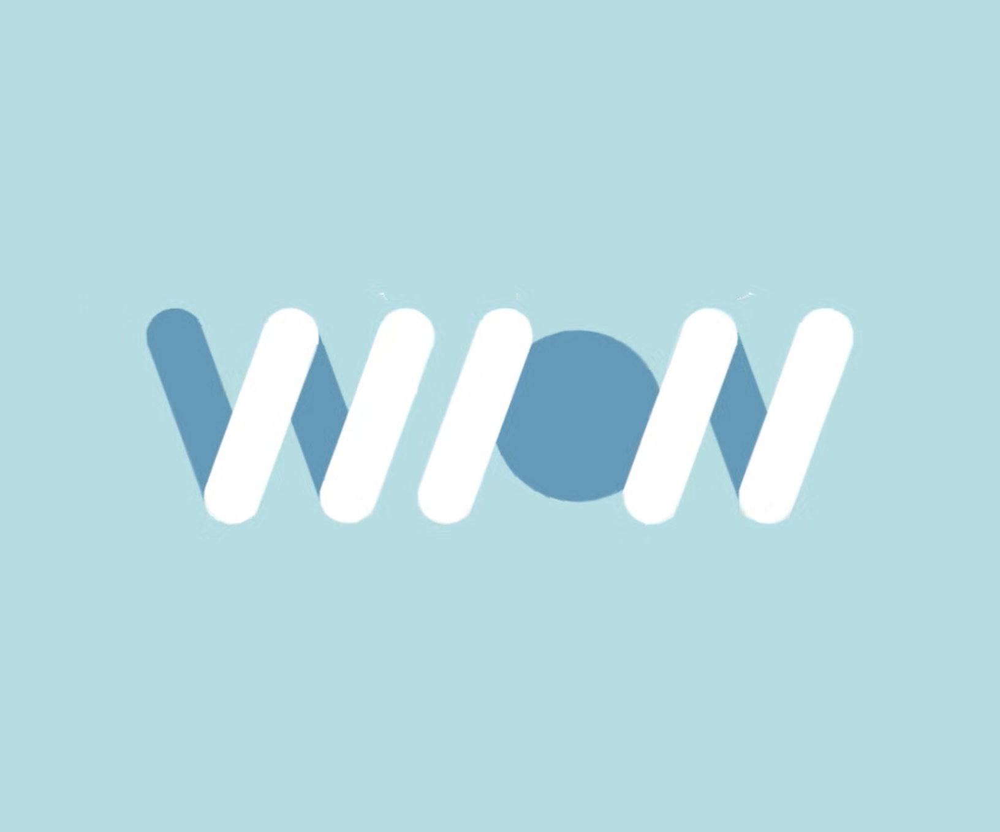

- [개발문서](#개발문서)
  - [본 프로젝트 다운 및 실행 관련](#본-프로젝트-다운-및-실행-관련)
  - [프로젝트 구조](#프로젝트-구조)
  - [코딩 컨벤션](#코딩-컨벤션)
  - [다중언어 제공(Language Support) 관련](#다중언어-제공language-support-관련)
    - [제공 언어](#제공-언어)
    - [기존 언어 수정 방법](#기존-언어-수정-방법)
  - [스타일(테마) 가이트](#스타일테마-가이트)
    - [간단한 배경](#간단한-배경)
- [위온 소개](#위온-소개)
  - [⚛️ 프론트엔드](#️-프론트엔드)
    - [지원자격](#지원자격)
  - [🐬 백엔드](#-백엔드)
    - [지원자격](#지원자격-1)
  - [협업 툴](#협업-툴)

# 개발문서

## 본 프로젝트 다운 및 실행 관련

1. Node.js 18 설치
   1. 노드 설치는 관리가 용이한 [NVM 사용 추천](https://github.com/coreybutler/nvm-windows)
2. yarn 설치

```bash
// 커멘드 창에 입력
npm install --global yarn
```

3. 해당 프로젝트 복사
   1. vs 코드를 사용할 경우 ctrl+shift+p ==> Git:Clone 선택 ==> 이 프로젝트의 링크 붙여넣기
4. 프로젝트 경로로 이동 후 dependencies 다운로드

```bash
yarn install
```

5. 프로젝트 시작

```bash
yarn start
```

## 프로젝트 구조

- app - 최종적인 페이지에 관련된 파일이 담긴 폴더, App.tsx만 존재하는 것이 이상적
- components - 버튼, 모달과 같이 범용적으로 자주 사용되는 소규모의 컴포넌트를 담는 폴더
- hooks - 모드 변경, 언어 변경과 같은 커스텀 훅을 저장하는 폴더
- languages - 영어, 한국어와 같은 언어와 관련된 정보/설정을 보관하는 폴더
- pages - MyPage, 지도 페이지 등등 큰 범위의 컴포넌트를 담는 폴더
- resource - 사진, 음악, 아이콘 등등 로직외의 요소들이 저장되는 폴더
- styles - 전체적인 프로젝트의 디자인, 테마의 로직 관련 파일들이 존재하는 폴더

> styled-components 파일 구조
>
> - components
>   - main-button
>     - MainButton.tsx - 실제 컴포넌트, 스타일링된 컴포넌트를 임포트해서 사용함
>     - StyledMainButton.tsx - 스타일링(styled``)용 컴포넌트
>
> **중요!!! MainButton에서 StyledMainButton을 임포트 할때는 일일이 다 임포트 하는 것이 아니라 아래의 커멘드로 직관적이게 한번에 임포트한다**
>
> ```js
> import * as S from "./StyledMainButton"
>   ...
> <S.MainButton> ... </S.MainButton>
> ```
>
> 위 처럼 임포트하면 손쉽게 스타일링용 컴포넌트와 일반 컴포넌트를 구분할 수 있다.

## 코딩 컨벤션

- 깃 커밋:

  - 메시지는 항상: **과거동사 + 파일명**
    - ex) Added ReadMe.md

- 주석: **왜 오류가 날건지 말해주세요!!!**
  - 좋은 예) // 이 변수는 ~ 에 쓰이기 때문에 ~ 하면 ~ 문제가 날 수 있음
  - 나쁜 예) 직관적인 이름을 추가되는 정보 없이 그냥 두번 설명하는 주석

```js
// 숫자
const [num, setNum] = useState();
```

## 다중언어 제공(Language Support) 관련

### 제공 언어

1. 한국어
2. 영어

### 기존 언어 수정 방법

1. src/languages 에서 en.json, kr.json 파일 클릭
2. 파일 속 JSON 객체의 "translation"에 원하는 페이지의 이름과 원하는 내용을 더한다

```js
// src/language/kr.json
{
  "translation": {
    "원하는 페이지 이름": {
      "첫번째 문단": "참고로 html 태그를 여기에 입력하면 그대로 반영됩니다. :) </br> 아 언어 수정하는거 <b>너무</b> 어려움... 그냥 까불지 말고 번역 API 쓸껄... 그게 더 어려웠을라나?"
    }
  }
}

```

- 주의할 사항 - 문장을 추가할 때에는 두 파일(en과 kr.json)에게 모두 추가해야함. 기본 언어는 한글로 현재 설정되어있음(영어 번역이 존재하지 않으면 그냥 한국어가 디스플레이됨)

## 스타일(테마) 가이트

### 간단한 배경

2023/01/24 기준, 다크 모드와 라이트 모드가 존재한다. 현재 유저의 디바이스 세팅에 따라 모드가 자동으로 변환되는 작업까지 구현이 완료되어 있으며 수정을 원할시 src/Styles 의 파일을 수정하면 된다

---

# 위온 소개

<table>
  <tr>
    <td>PM & Design</td>
    <td>박서윤</td>
  </tr>
  <tr>
    <td>Dev(개발팀)</td>
    <td>최현묵, 배범수, 정예준</td>
  </tr>
  <tr>
    <td>Operations(운영팀)</td>
    <td>정예승, 김소영, 박소현, 김성진, 한지혜, 이관주, 전성민</td>
  </tr>
  <tr>
    <td>졸업 멤버</td>
    <td>방병욱, 김혜민, 옥예은, 이규리, 이세원, 최윤서</td>
  </tr>
</table>

<h1>기술 스택</h1>

## ⚛️ 프론트엔드

- React Native 0.69
- TypeScript
- Redux Toolkit
- React Router Native
- Styled Components
- yarn(npm X)
- (리액트만 알아도 좋습니다 :))

### 지원자격

- React를 한번은 다뤄봤다
- 위의 기술들중 3개 이상은 개념적으로 알고있다
- 다른 언어/프레임워크를 다루지만 같이 배워보고싶다

## 🐬 백엔드

- Nest.js
- MongoDB(mongoose)

### 지원자격

- Express, Nest.js 경험이 있으신 분
- 백엔드 개발 경험이 있으신 분(다른 프레임워크 경험이 있으시다면 금방 배우실 겁니다!)
- 개발을 1도 모르지만, 이번 기회에 같이 배우면서 작업하실 분(대환영🙇‍♂🙇‍♂🙇‍♂)

## 협업 툴

<table>
  <tr>
    <td>
      <a
        href="https://join.slack.com/t/wion-workspace/shared_invite/zt-1dos1w7pv-dlyTmDmkOjYp5pjs7kHS8w"
        >Slack</a
      >
    </td>
    <td>
      <a
        href="https://docs.google.com/document/d/1Sbs515iTLo5PZHlzADYajagYliFWSaWuGYZVU1Ljczo/edit?usp=sharing"
        >개발문서</a
      >
      (Notion 능력자 등장시 바로 변경)
    </td>
  </tr>
</table>
